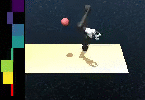

# RL on Jaco Arm in DeepMind Control Suite

* This repository provides the tools to train a Jaco2 arm with dm_control. It depends on our version of the [dm_control](https://github.com/johannah/dm_control/commit/c96d43f9481ed30c202a980cf06f3cdaced8854f). 
* The agent implementations are taken from the [Official TD3 repository](https://github.com/sfujim/TD3).

### Example training for Jaco2 7DOF robot with position controllers:
```
python main.py --domain jaco --task relative_position_reacher_7DOF --policy TD3 --seed 100 --device 'cuda:0' --exp_name 'jaco_relative_reacher'
```

### Example plot and eval latest trained model
```
python main.py --domain jaco --task relative_position_reacher_7DOF --policy TD3 --load_model results/jaco_relative_reacher_00/ --plot_action_movie

```


--- 

### Example training for reacher:
```
python main.py --domain reacher --task easy --policy TD3 --seed 100 --device 'cuda:0' --exp_name 'reacher_easy'
```

### Example plot and eval previous experiment
```
python main.py --domain reacher --task easy --policy TD3 --load_model 'results/reacher_easy_00'  --eval --plot_movie
```


### General tips:

Debugging [doc](https://docs.google.com/document/d/1FZcfzBCuFEt6Y-qjXhoz6kRAw_23119vy4JQ7mlBOYM/edit?usp=sharing) with details on robot positions and angles. 
